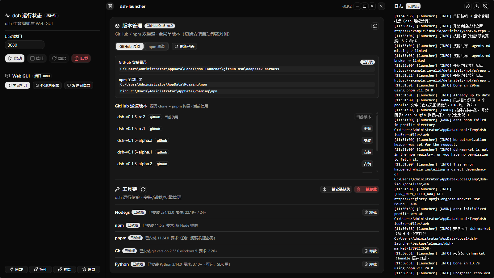
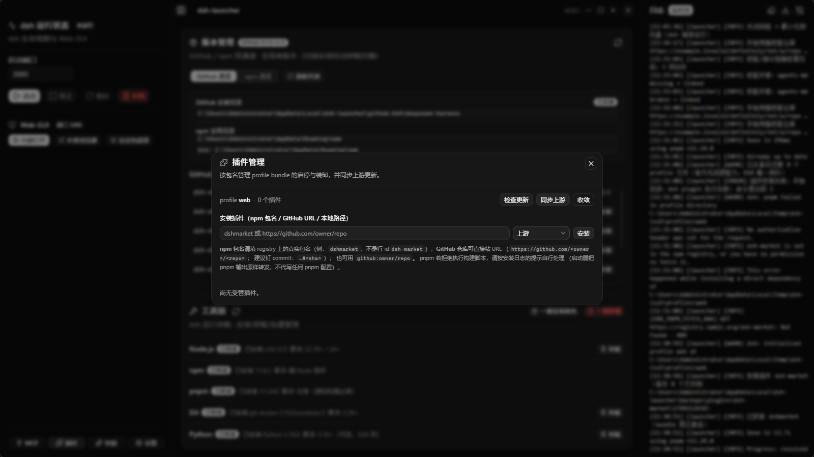
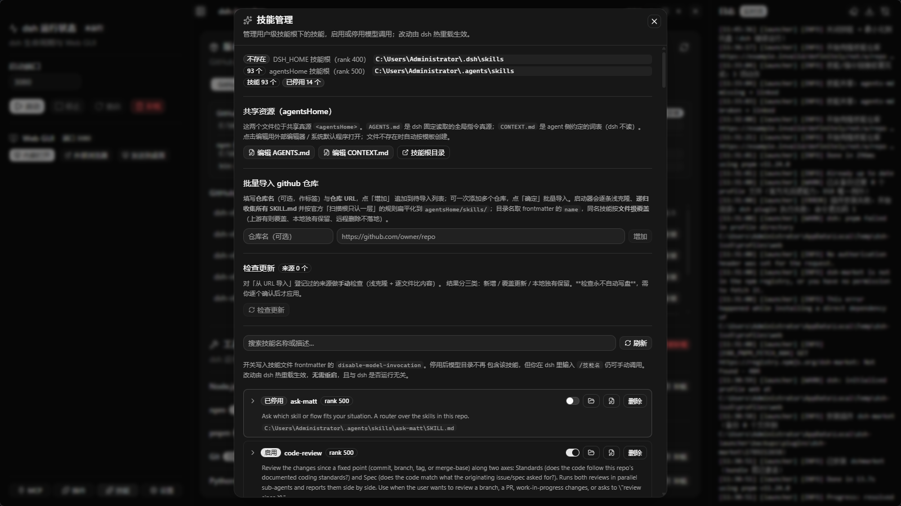
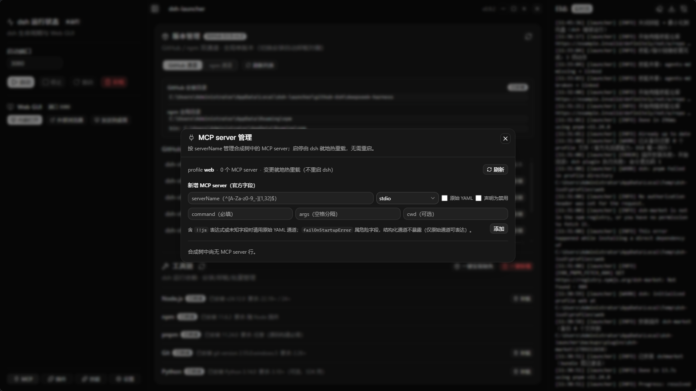
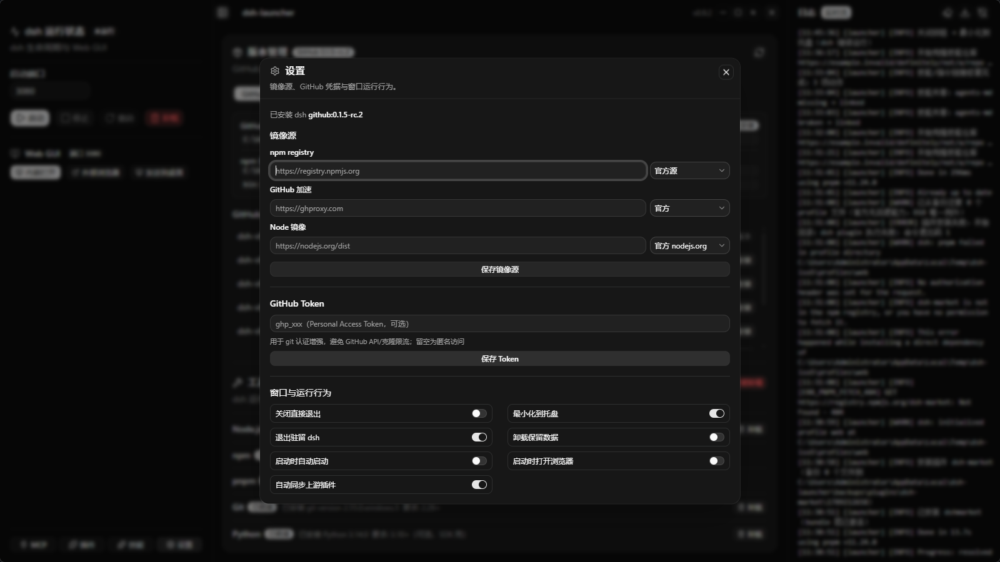

<div align="center">

# dsh-launcher

**给 [deepseek-harness](https://github.com/deepseek-ai/deepseek-harness)（`dsh`）配一个 Windows 桌面管家。**
装它、启动它、管它的插件和技能、看它的日志 —— 全在一个窗口里点鼠标完成，不用再跟命令行打交道。

[](#安装)
[](https://tauri.app)
[](https://www.rust-lang.org)
[](https://react.dev)
[](LICENSE)
[](https://github.com/youridol/dsh-launcher/releases)
[](https://github.com/topics/dsh-plugin)

</div>

---

## 这是个什么东西？

`deepseek-harness`（简称 `dsh`）是deepseek 开源的 harness 框架，但它启动方式和更新主要靠命令行操作，
deepseek-harness 还在开发前期没有稳定下来更新方式，更新特别麻烦；
装它要 npm 或 git 编译，启动要敲 `dsh web --port 3080`，管插件要 `dsh plugin add ...`，
日志还得去翻文件。

**dsh-launcher 就是把这些事搬进一个启动器和提供桌面窗口**：

- 🖱️ **点一下就能装** —— Node / Git / Python 运行环境缺什么补什么，dsh 本体支持 npm 与 GitHub 两条安装通道；
- ▶️ **点一下就能跑** —— 启动 / 停止 / 重启 `dsh web`，状态实时显示，还能一键内嵌打开 Web GUI（自动带上免登录 token，不用手动复制那串地址）；
- 🧩 **插件像 App 一样管** —— 装、卸、开着、关掉，改完 dsh 自己热重载，**不用重启**；
- ✨ **技能点点开关** —— 管理 `~/.agents/skills` 下的技能，谁能被模型调用一目了然，还能从 GitHub 仓库批量导入；
- 🔌 **MCP server 也能管** —— 加一个 MCP 工具服务器，实时看到它有没有生效；
- 📜 **日志有个"直播"面板** —— dsh 和启动器自己的日志都在这儿滚动，出问题一眼能看见。

> **一句话**：如果你在用 dsh，但不想天天记命令、敲路径、翻日志，就装它。

**它不做什么**（重要）：
- **不改 dsh 源码**，只用官方开放的 CLI / 包 / GitHub tag —— dsh 升级了它照样能用；
- **不接管你的数据**：`DSH_HOME`（默认 `~/.dsh`）里的东西只读展示，卸载时默认保留；
- **不偷偷下东西**：所有安装动作都是你点了才做，界面会实时显示进度与日志。

---

## 界面速览

### 1. 主界面：版本管理 + 工具链 + 实时日志

左边看运行状态、点启动；中间管 dsh 版本（npm / GitHub 双通道）和运行环境（Node / npm / pnpm / Git / Python）；右边是滚动的实时日志。



### 2. 插件管理：装、卸、开、关，热重载

填 **npm 包名**（如 `dshmarket`）或 **GitHub 仓库 URL**（如 `https://github.com/owner/repo`）即可安装。
`upstream` 来源的插件还能自动同步新版本 / 新 commit。



### 3. 技能管理：让模型用上你的技能

按官方扫描根管理技能（`dsh` 的 `~/.dsh/skills`、共享的 `~/.agents/skills`），
可单个启停、可批量从 GitHub 仓库导入、可检查上游更新（**纯手动，永不自动写盘**）。



### 4. MCP server 管理

按 `serverName` 管理合成树里的 MCP 工具服务器；启停由 dsh 就地热重载，不需要重启。



### 5. 设置：镜像源、Token、窗口行为

npm registry / GitHub 加速 / Node 二进制三类镜像源，GitHub Token（用于防限流 + git 认证，落盘前用 Windows DPAPI 加密），以及托盘、自动启动等开关。



---

## 快速开始

### 装

1. 打开 [Releases](https://github.com/youridol/dsh-launcher/releases)，下载最新的 `dsh-launcher_<版本>_x64-setup.exe`；
2. 双击安装（NSIS 简体中文安装器，**免管理员**，装到当前用户目录）；
3. 想要免安装版？下载 `..._x64_portable.zip` 解压即用。

> **遇到「Windows 已保护你的电脑」/「未知发布者」？**
> 这是正常的 —— 本项目**不做代码签名**（刻意的产品决策，非构建疏忽），所以 Windows SmartScreen 会提示。
> 点「**更多信息**」→「**仍要运行**」即可。
> 想先核对文件有没有被篡改？下载页附带 `SHA256SUMS.txt`，用 `sha256sum -c SHA256SUMS.txt` 校验。

### 用（典型流程）

1. 打开 **「工具链」** → 缺什么点「一键安装缺失」（Node 免 UAC；Git / Python 会弹 UAC 确认）；
2. 打开 **「版本管理」** → 选 npm 或 GitHub 通道装一个 dsh；
3. 点左侧 **「启动」** → 状态变「运行中」；
4. 点 **「内嵌打开」** → 直接在窗口里用 dsh 的 Web GUI（token 自动带上，不用管）；
5. 想扩展能力 → 进 **「插件」/「技能」/「MCP」** 面板按需装。

---

## 功能一览

| 模块 | 能做什么 |
|---|---|
| **dsh 生命周期** | 启动 / 停止 / 重启 `dsh web`（端口可配，默认 3080）；五态实时状态；崩溃自动归因到不兼容插件并**可逆禁用** |
| **版本管理** | npm 通道（registry 装包）与 GitHub 通道（clone + pnpm 构建）双通道；全局单版本，切换 = 先卸载再装；安装过程实时进度。**换版本/换通道不碰 `DSH_HOME`** —— 会话、技能、插件配置全部保留 |
| **工具链** | 检测 Node(22.19+/24+) / npm / pnpm / Git(2.26+) / Python(3.10+，可选)，显示"已装/缺失/版本不符"，支持单个或批量装卸 |
| **Web GUI 集成** | 内嵌窗口打开 dsh Web UI（自动带 token）；也可用外部浏览器或创建桌面快捷方式 |
| **系统托盘** | 打开主窗口 / 启动 / 停止 / 重启 / 退出；可配置「关闭窗口最小化到托盘」「退出时驻留 dsh」 |
| **日志** | dsh 与启动器日志统一落盘（按天轮转 + 10MB 切割 + 保留 30 天）；前端实时流式展示；可导出（含 token 打码版） |
| **插件管理** | 按包名独立启停（写 profile 受管 patch 区块，dsh **热重载、无需重启**）；装卸走官方 `dsh plugin` 通道；`upstream` 插件可自动同步并钉 git commit；自研（本地路径）插件**永不**被同步改动 |
| **技能管理** | 列出用户级技能根下的技能；单个启停（= 写 `disable-model-invocation`）；可恢复删除（移入 `.trash/`）；从 GitHub 仓库批量导入并扁平化；**手动**检查更新（逐文件比较，永不自动写盘） |
| **MCP server 管理** | 按 `serverName` 增删启停；写受管区块，dsh 热重载；危险字段 `failOnStartupError` 结构化通道不暴露；表达式（`!!js`）行只读 |
| **共享资源** | 一键用外部编辑器打开 `~/.agents/AGENTS.md` / `CONTEXT.md` / 技能根目录（文件不存在时按模板创建） |
| **镜像源** | npm registry / GitHub 加速 / Node 二进制三类独立配置（含常用镜像快捷选择） |
| **命令行** | `dsh-launcher plugin\|skill\|mcp ...` —— 与 GUI 共用同一套逻辑，便于脚本化 / CI 验收 |

<details>
<summary><b>命令行用法（点开）</b></summary>

```bash
# 插件
dsh-launcher plugin list [--json]
dsh-launcher plugin install <spec> [--origin upstream|in-house|unknown]
dsh-launcher plugin enable|disable|uninstall <package>
dsh-launcher plugin sync [--check]        # 同步 upstream 插件（--check 只检查不落盘）
dsh-launcher plugin repair [--package <pkg>]

# 技能（注意：技能列表请用 status，没有 skill list）
dsh-launcher skill status [--json]
dsh-launcher skill apply [--mode auto|link|config] [--resource skills|agents-md|context-md]
dsh-launcher skill migrate [--dry-run]    # 迁移冲突资源（原文件改名保留，绝不删除）
dsh-launcher skill repair-links [--json]

# MCP
dsh-launcher mcp list [--json]
dsh-launcher mcp add --server-name <n> --transport <stdio|streamable-http> [选项]
dsh-launcher mcp remove <serverName>
dsh-launcher mcp enable|disable <serverName>
```

</details>

---

## 安装方式细节

### 两种 dsh 安装通道

| 通道 | 怎么装 | 适用 |
|---|---|---|
| **npm** | `npm i -g @deepseek-ai/dsh@<版本>` | 想要官方发布的稳定版，装得快 |
| **GitHub** | `git clone --depth 1 --branch <tag>` → `pnpm install` → `pnpm build`，并生成全局 `dsh.cmd` | 想用最新源码（含 rc / alpha） |

全局同时只有一个 dsh 生效 —— 切换通道时启动器会先清理对侧（ADR-0003）。

### 🔒 换版本 / 换通道 / 卸载，都不会碰你的数据

**你可以随便切版本、切通道 —— 会话记录、技能、插件、配置全都在。**

原因是 dsh 把用户数据集中放在 **`DSH_HOME`**（默认 `~/.dsh`），而版本切换只动「程序本体」：

| 你的数据（在 `~/.dsh` 里） | 说明 |
|---|---|
| `sessions/` | **会话历史**（你的聊天记录） |
| `settings.yaml` / `.credentials.yaml` | 设置与凭据 |
| `storages/` / `task-board/` | 会话投影缓存、任务板 |
| `profiles/<name>/` | 已装插件与其配置（`package.json`、`cordis.patch.yml`、`node_modules`） |
| `~/.agents/skills/` | 你的技能（共享真源，官方扫描根） |

**启动器实际做了什么（可对照源码）：**

| 动作 | 动的部分 ✅ | 不碰的部分 🔒 |
|---|---|---|
| **切换 npm ⇄ GitHub 通道** | 删另一条通道的**程序本体**（npm 全局包，或 `github-dsh` 源码目录 + 自家 `dsh.cmd` shim） | **`DSH_HOME` 全部数据**（代码注释即明确写“不清 DSH_HOME 数据”，`commands/version.rs`） |
| **升级 / 降级到另一个版本** | 同理，只替换程序本体 | 同上（会话 / 技能 / 插件原样保留） |
| **卸载 dsh（默认）** | 程序本体（npm 全局包 / 源码目录 / 全局命令） | `DSH_HOME` —— 默认 **保留**（`keepDshHomeOnUninstall` 默认为 `true`） |
| **卸载 dsh（仅当你手动关掉“卸载保留数据”）** | 程序本体 + `~/.dsh` | 删前会**校验目录特征**（含 `profiles/` 或 `settings.yaml`），不像 dsh 数据就拒绝删除 |

> **要点**：切版本不会清技能、不会丢会话、也不会重置插件配置。装上不同版本后，它们读的是**同一个 `DSH_HOME`**。
>
> **例外（需你知情）**：插件本身是装在 `~/.dsh/profiles/<name>/` 里的，跟 dsh 版本无关；
> 但如果某个插件与新版 dsh **不兼容**，新版启动时可能报错 —— 此时启动器会自动把**冒头的那一行禁用（可逆）**并提示你，不会去卸载它。

### 插件安装：三种来源形态

在「插件」面板的输入框里可以填：

1. **npm 包名** —— 写 registry 上的**真实包名**，例如 `dshmarket`（⚠️ 不是它在配置里的行 id `dsh-market`）；
2. **GitHub / Git 仓库 URL** —— 例如 `https://github.com/owner/repo`，建议钉 commit：`https://github.com/owner/repo#<sha>`；
   也支持 `github:owner/repo`、`git+https://...git#main` 等 pnpm 原生写法；
3. **本地路径** —— 例如 `link:../my-plugin`（这类「自研」插件不会被自动同步改动）。

> **pnpm 拦住构建脚本？** 部分插件安装时要跑 build/prepare 脚本，pnpm ≥10 默认会拦下并打印确切的键名。
> 按提示把那一行加到 **profile 目录**的 `pnpm-workspace.yaml` 的 `allowBuilds` 下即可 —— 启动器会把这个路径和键名一并显示在错误信息里。
> （启动器**不代劳**这一步：不写 profile 配置文件，与官方 dsh 行为保持一致。）

---

## 它是怎么做的（技术）

```
┌─────────────────────────────────────────────────┐
│  React 19 + TypeScript + shadcn/ui（深色主题）    │  ← 前端：UI 渲染
├─────────────────────────────────────────────────┤
│  Tauri 2 IPC（48 个类型化命令 + 事件推送）         │  ← 桥接层
├─────────────────────────────────────────────────┤
│  Rust：core/（进程·端口·配置·日志·工具链·         │  ← 后端：真正干活
│  GitHub·插件·技能·MCP）+ commands/（IPC 薄壳）    │
└─────────────────────────────────────────────────┘
```

- **后端**（Rust / Tauri 2）：进程生命周期、端口探测、工具链检测与安装、日志落盘、配置持久化、版本与通道管理、事件推送、插件 / 技能 / MCP 管理。
- **前端**（React 19 + TS + shadcn/ui + Tailwind CSS 4）：所有界面与交互。
- **进程模型**：子进程一律无窗口启动（`CREATE_NO_WINDOW`）；dsh 的 stdout/stderr 重定向到文件后 tail 读取（解决 Windows 下管道缓冲导致 token 迟迟不出现的问题）；停止时先发 `taskkill /PID /T`（即 SIGTERM 语义，等待约 1 秒），未退再 `/F` 强杀，最后按端口兜底清剿残留（**清剿前校验监听进程确为 dsh**，防误杀）。
- **前后端类型契约**：有一条 CI 测试逐字段对账 Rust DTO ↔ TS interface，改名漏改一侧会直接构建失败。

### 项目结构

```
dsh-launcher/
├── src/                     # 前端（React + TS + shadcn/ui）
│   ├── components/          #   面板：StatusCard / VersionPanel / ToolchainPanel
│   │                        #         PluginsPanel / SkillsPanel / McpPanel / ...
│   ├── components/ui/       #   shadcn/ui 组件
│   ├── hooks/               #   useTauriEvent / useResizablePanel / useIsMobile
│   └── lib/tauri.ts         #   IPC 的类型化封装（与 Rust 命令一一对应）
├── src-tauri/               # 后端（Rust）
│   ├── src/core/            #   核心逻辑（process / port / config / logging /
│   │                        #   toolchain / github / plugin / skill / mcp / tray …）
│   ├── src/commands/        #   Tauri IPC 命令（薄壳：spawn_blocking + 事件广播）
│   ├── src/cli.rs           #   无 GUI 命令行（与 GUI 共用同一套 core）
│   └── capabilities/        #   Tauri 2 权限声明（最小化授权）
├── docs/
│   ├── DESIGN.md            #   设计总览
│   └── adr/                 #   架构决策记录 ADR-0001 ~ 0009
├── png/                     #   本 README 的界面配图
└── .github/workflows/       #   CI / Release / Nightly 三条流水线
```

---

## 开发

```bash
npm install          # 安装依赖（若本机 .npmrc 含 omit=dev，需加 --include=dev）
npm run tauri dev    # 开发模式（前端热更新 + Rust 热重载）
npm run build        # 只构建前端（tsc 类型检查 + vite build）
npm run tauri build  # ★ 打包：产出可运行的 exe + NSIS 安装包
```

### ⚠️ 发布构建必须启用 `custom-protocol`（踩过的坑）

**不要用裸 `cargo build --release` 产出发布件。**

`tauri::is_dev()` 的实现是 `!cfg!(feature = "custom-protocol")`（见 `tauri-2.11.5/src/lib.rs:308`）。
**缺少该 feature 时，即使加了 `--release`，二进制仍处于开发模式**：它不去加载内嵌的前端资源，
而是去连 `build.devUrl`（`http://localhost:1420`）—— 于是窗口报
`ERR_CONNECTION_REFUSED`（"localhost 拒绝连接"），且构建输出目录**不会**生成 `tauri-codegen-assets`。

| 命令 | 结果 |
|---|---|
| ✅ `npm run tauri build` | 推荐。`tauri build` 会自动启用该 feature（CI 的 tauri-action 同理） |
| ✅ `cargo build --release --features custom-protocol` | 需要直调 cargo 时用这个 |
| ❌ `cargo build --release` | 不启用任何非 default feature → 得到 dev 模式二进制 |

> **自检**：看构建输出目录有没有 `target/release/build/dsh-launcher-*/out/tauri-codegen-assets/` ——
> 有 = 前端已内嵌（正常）；没有 = dev 模式（启动会连不上）。

### 测试

```bash
cargo test --manifest-path src-tauri/Cargo.toml --lib          # Rust 单元测试
cargo test --manifest-path src-tauri/Cargo.toml --test <name>  # 集成测试
npx tsc --noEmit                                               # 前端类型检查
```

---

## 持续集成与发布

三条 GitHub Actions 流水线（`.github/workflows/`）：

- **CI** —— 每次 push / PR：版本一致性门禁 → `tsc` 类型检查 → 前端构建 → `cargo check`（零警告）→ 单元 + 离线集成测试；
- **Release** —— push 到 master：自动递增 PATCH 版本、写 CHANGELOG、构建 NSIS 安装包 + 便携 zip + `SHA256SUMS.txt`，发布 GitHub Release；
- **Nightly** —— 每晚跑依赖真实网络 / 真实 dsh 环境的 `#[ignore]` 集成测试（失败不阻断 master）。

版本号由 `scripts/bump-version.mjs` 同步「五文件六落点」并带一致性校验（ADR-0004 / ADR-0009），防止手工改一处导致漂移。

---

## 常见问题（FAQ）

<details>
<summary><b>装插件报 <code>ERR_PNPM_FETCH_404</code>？</b></summary>

说明这个 **npm 包名不存在**（或拼写有误 / 无权限）。请确认用的是 registry 上的**真实包名**。
如果其实想装的是某个 GitHub 仓库，请改用 URL 形态：`https://github.com/owner/repo`。
启动器会把 pnpm 的原始报错和这个提示一起显示在界面上。
</details>

<details>
<summary><b>装插件报 <code>ERR_PNPM_GIT_DEP_PREPARE_NOT_ALLOWED</code>？</b></summary>

pnpm ≥10 出于安全考虑，默认拦下依赖的 build / prepare 脚本。pnpm 会在报错里打印**确切的键名**，
把它加到 profile 目录下 `pnpm-workspace.yaml` 的 `allowBuilds` 里再重试即可。
启动器会显示完整报错 + profile 路径 + 该键名，但**不代劳修改**（与官方 dsh 行为一致）。
</details>

<details>
<summary><b>内嵌打开 Web GUI 提示未就绪 / 拿不到 token？</b></summary>

dsh 的访问 token 是**进程级随机数**，只从它自己的 stdout 打印。
- 由启动器启动的实例：冷启动可能较慢（插件多时可达 20 秒以上），状态会持续显示"启动中"并自动收敛；
- **别人（或你自己）在命令行手动启动**的实例：启动器**原理上拿不到**它的 token。此时界面会提示你可以「**接管**」——
  停止该实例并由启动器重新拉起，从而捕获 token（会中断该实例上的会话，故需你确认）。
</details>

<details>
<summary><b>状态一直显示"启动中"？</b></summary>

v0.9.1 起已修复早期版本"超时即卡死"的问题：启动就绪由**启动探活线程**与**每 5 秒状态对账线程**共同保证，
冷启动再慢也会持续探测直到端口就绪。若长期不收敛，请查看日志面板排查端口冲突或插件报错。
</details>

<details>
<summary><b>换个 dsh 版本，我的会话 / 技能 / 插件会没吗？</b></summary>

**不会。** 你的数据都在 `DSH_HOME`（默认 `~/.dsh`）—— 包括 `sessions/`（会话）、`settings.yaml`、
`profiles/`（插件）、以及 `~/.agents/skills/`（技能）。版本切换（含 npm ⇄ GitHub 通道互切）
**只替换程序本体**，一个字节都不会碰这些目录；它们代码里就明确写着“不清 DSH_HOME 数据”。

连**卸载** dsh 也默认**保留**数据（`keepDshHomeOnUninstall` 默认开）；只有你主动关掉该开关，
启动器才会删 `~/.dsh` —— 而删除前还会校验目录特征（含 `profiles/` 或 `settings.yaml`），不像 dsh 数据就拒删。

详见上方「🔒 换版本 / 换通道 / 卸载，都不会碰你的数据」。
</details>

<details>
<summary><b>会不会误杀我自己的进程？</b></summary>

不会。停止 / 清剿前会**校验端口监听进程的命令行确实形如 dsh**（含 `deepseek-harness` / `bin.ts` / `@deepseek-ai` 等特征）；
无法判定时宁可残留也不误杀，并在日志里明确警告。
</details>

<details>
<summary><b>我的数据会被改动吗？</b></summary>

- `DSH_HOME`（默认 `~/.dsh`）：**只读展示**；卸载时默认保留（可用开关改为删除，删除前还会校验目录特征防误删）；
- dsh 配置文件：启动器只拥有 `cordis.patch.yml` 里 **marker 包裹的受管区块**，块外内容逐字节保留；
- 「自研」插件（本地路径 / link）与「本地独有的技能文件」：**永不被自动同步或删除**。
</details>

---

## 文档

| 文件 | 内容 |
|---|---|
| [`CONTEXT.md`](CONTEXT.md) | 术语表（词表，不是 spec） |
| [`docs/DESIGN.md`](docs/DESIGN.md) | 设计总览：模块划分、分层纪律、核心流程 |
| [`docs/adr/`](docs/adr/) | 架构决策记录 **ADR-0001 ~ 0009**（安装通道 / 生命周期 / 单版本 / 版本号 / 插件与技能 / MCP / 技能管理 / 技能导入 / 审计整改） |
| [`CHANGELOG.md`](CHANGELOG.md) | 逐版本变更日志 |

---

## 技术栈

**Tauri 2** · **Rust** · **React 19** · **TypeScript** · **Vite** · **Tailwind CSS 4** · **shadcn/ui**（base-nova）

---

## 许可

[MIT](LICENSE) © 2026 dsh-launcher contributors

<div align="center">

**如果它帮你省下了敲命令的时间，欢迎点个 ⭐ Star**

[](https://github.com/youridol/dsh-launcher/stargazers)

</div>
